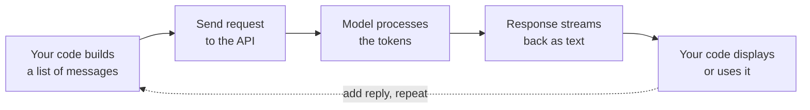

---
tags:
  - foundations
  - stage-0
  - prompt-engineering
  - llm-basics
---

# Stage 0 — Foundations: Talk to an LLM Through Code

> **Goal:** Send your first message to a language model from your own code, get a response back, and understand exactly what happened in between.

This is where the roadmap stops being theory. By the end of Stage 0 you'll have a working chatbot you built yourself — and, more importantly, a mental model of what an LLM actually *is* from an engineer's seat: a function you call over the internet that takes text and returns text.

## What actually happens when you "talk" to an LLM

Every interaction, no matter how fancy the app, is the same loop underneath:

There's no magic. You assemble some text, send it, and get text back. Everything you build later — RAG, agents, all of it — is a more sophisticated version of this exact loop.

## The concepts you'll learn here

### Messages and roles

An LLM conversation isn't one blob of text. It's a **list of messages**, each with a role:

- **System** — the instructions that set the model's behavior ("You are a helpful tutor"). The user usually doesn't see this.
- **User** — what the person types.
- **Assistant** — what the model replied. You send past replies back so the model "remembers" the conversation.

The model has no memory of its own. **You** rebuild the whole conversation and send it every single time. That realization is the foundation of everything.

### Tokens

Models don't read words — they read **tokens**, chunks of text roughly ¾ of a word. "Engineering" might be two tokens. Why you care:

- **You're billed per token** — input *and* output.
- Tokens are the unit behind every limit and every cost. Watch them from day one.

### Context window

The **context window** is the maximum number of tokens the model can consider at once — its short-term memory. Exceed it and the earliest messages fall off. Long conversations, big documents, and cost all run into this ceiling. Managing it is a real part of the job.

### Temperature

**Temperature** controls randomness. Low (near 0) = focused and repeatable; higher = more creative and varied. Same prompt, different temperature, different answer. Use low for extraction and code, higher for brainstorming.

### Streaming

Instead of waiting for the full reply, **streaming** returns tokens as they're generated — the "typing" effect you see in chat apps. It makes your app feel fast and is worth wiring in early.

### Prompt engineering (the real leverage)

How you ask changes what you get. The core moves:

- **Be specific.** Vague prompt, vague answer.
- **Zero-shot vs few-shot.** Give examples when you want a specific format or style.
- **Role prompting.** "You are an expert Python reviewer…" shapes the output.
- **Ask for structure.** Tell it to reply in JSON when you need machine-readable output.
- **Chain-of-thought.** "Think step by step" improves reasoning on harder tasks.

## Build it: the Stage 0 project

Learning sticks when you ship. The project for this stage is a CLI chatbot — build that one end to end.

### CLI Chatbot

A terminal chatbot that holds a conversation, remembers context, and streams replies. It should:

- Read your input in a loop and print the model's reply.
- Maintain conversation history so the model remembers earlier turns (send the full message list each request).
- Use a configurable system prompt and stream the response token-by-token.
- Support `exit` to quit and `reset` to clear history.
- Load the API key from an environment variable, never hard-coded.

**What it teaches:** messages/roles, conversation memory, streaming, API keys — the whole Stage 0 loop in one artifact.

!!! success "See the finished project"
    I built this one — **[golamrasul97/cli-chatbot on GitHub](https://github.com/golamrasul97/cli-chatbot)**. Clone it, read the single commented file, and run it against your own Ollama or API key.

## Other project ideas for this stage

Want to push further? Any of these reinforce the same fundamentals from a different angle:

- **Structured Extractor** — feed in messy text (a review, an email) and get back clean JSON: sentiment, key points, action items. Teaches prompting for *reliable structure* and low temperature.
- **Prompt Playground** — a tiny web UI (Streamlit or Gradio) where you tweak the system prompt and temperature and compare outputs side by side. Teaches how much prompt and settings actually change results.
- **Token & cost counter** — a small script that takes any prompt, reports the token count, and estimates the cost. Makes tokens and the context window concrete.
- **Persona switcher** — one chatbot, several system prompts (tutor, code reviewer, translator) you swap at runtime. Drives home how much the system role shapes behavior.

## You're done with Stage 0 when…

- [ ] You have a working chatbot you built and understand line by line.
- [ ] You can explain why the model "remembers" only what you resend.
- [ ] You can force valid JSON output from a prompt.
- [ ] You can explain how temperature changes an answer.

## What's next

You've got a model that's smart but knows nothing about *your* world. **Stage 1 — RAG** fixes that: you'll give the model your own documents and have it answer questions using them, with citations. That's where AI engineering starts to feel like a superpower.

*Part 2 of the AI Engineering Roadmap. Built in public — every concept ships with a project you can build yourself.*
