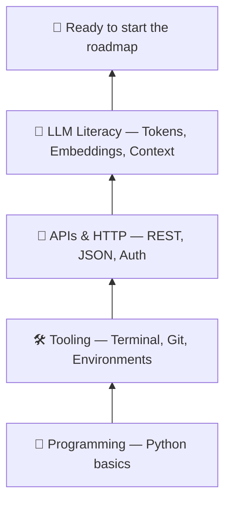

---
tags:
  - foundations
  - prerequisites
  - start-here
---

# What You Must Know *Before* Starting AI Engineering

> You don't need a PhD, and you don't need deep calculus. You need a small, specific set of foundations — and the discipline to start before you feel ready.

This is the entry point to my AI Engineering Roadmap. Before we build chatbots, RAG systems, and agents, let's get honest about what you actually need on day one — and, just as importantly, what you *don't*.

## The reframe that saves you months

Most people quit before they start because they think "AI" means mastering linear algebra, gradient descent, and a stack of research papers first.

That's the **research track** — building and training the models themselves.

We're on the **engineering track** — *building products* with models that already exist. It's a different job with different prerequisites. You'll call models through an API, feed them your data, give them tools, evaluate them, and ship them. For that, you don't need to derive backpropagation. You need to be a solid software engineer who understands how LLMs behave.

Hold onto that distinction. It's the difference between starting this month and "starting someday."

## The foundations, visualized

Everything below builds on the layer under it. Get the base solid; the top comes fast.

## The must-haves (before day 1)

These five are non-negotiable. You don't need mastery — you need working competence.

### 1. Python

The language of AI engineering. You need the fundamentals, not the deep cuts:

- Variables, data types, lists, dictionaries
- Loops, conditionals, functions
- Basic object-oriented programming (classes)
- Awareness of `async` (you'll meet it when calling APIs)

**You're ready when:** you can write a script that loops over a list, calls a function, and handles an error without copy-pasting the whole thing.

### 2. Tooling: terminal, Git, and environments

This is where beginners underestimate the gap. You'll live in these tools daily.

- **Terminal / command line** — running commands, navigating folders
- **Git & GitHub** — version control; also where your portfolio lives
- **Virtual environments** — isolating a project's dependencies (`venv`, or newer tools like `uv`)

**You're ready when:** you can clone a repo, create a virtual environment, install a package, and push a change to GitHub.

### 3. APIs & HTTP

You'll talk to language models over the web, so you need to understand the conversation.

- What a **REST API** is
- **JSON** — the format requests and responses use
- **Authentication** — API keys and why you never commit them to Git
- Making requests and handling errors and retries

**You're ready when:** you can send a request to a public API and parse the JSON that comes back.

### 4. LLM literacy (conceptual)

Understand *how the model behaves* — no math required.

- **Tokens** — how models read and get billed
- **Context window** — the model's short-term memory limit
- **Embeddings** — turning meaning into numbers (the engine behind search and RAG)
- **Training vs inference** — why the model "knows" some things and not others
- **Temperature** — why the same prompt gives different answers

**You're ready when:** you can explain, to a friend, why an LLM sometimes "forgets" the start of a long conversation.

### 5. The right mindset

Technically optional, practically decisive.

- **Build → measure → learn.** Ship ugly, then improve.
- **Read docs, not just tutorials.** The field moves monthly; docs are the source of truth.
- **Think in cost.** Every API call costs tokens and money. Good engineers always know their numbers.

## The "learn as you go" list — don't block on these

These matter *eventually*, but waiting to master them first is procrastination in disguise:

- Linear algebra and probability intuition
- Cloud platforms (AWS/GCP/Azure)
- Docker and deployment
- Databases beyond the basics

You'll pick these up naturally as specific projects demand them. Start without them.

## Your readiness checklist

You're ready to begin Stage 0 when you can honestly tick these:

- [ ] I can write and run a basic Python script.
- [ ] I can use the terminal and push code to GitHub.
- [ ] I can create a virtual environment and install a package.
- [ ] I can call a public API and read the JSON response.
- [ ] I can explain tokens, context windows, and embeddings in plain words.

Missing a couple? That's fine — spend a week closing the gaps. Missing all of them? Start with Python and tooling; they unlock everything else.

## What's next

With the foundations in place, we start building. **Stage 0 — Foundations** takes your first real step: talking to an LLM through code and understanding exactly what happens when you do.

*This is Part 1 of the AI Engineering Roadmap — a series I'm building in public to learn, revise, and grow. Every concept comes with a project you can build yourself.*
